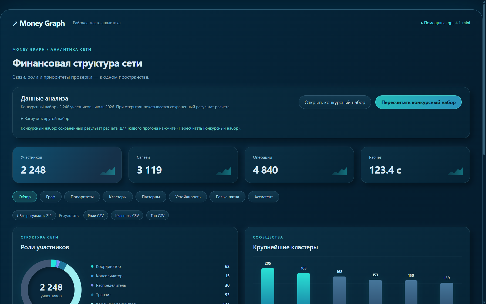
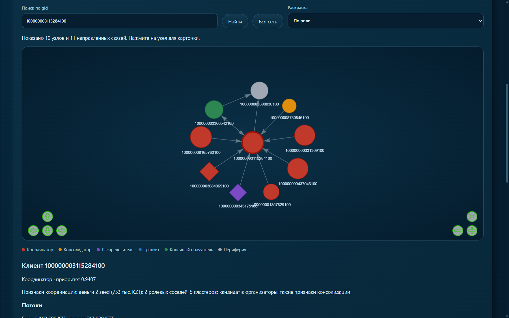
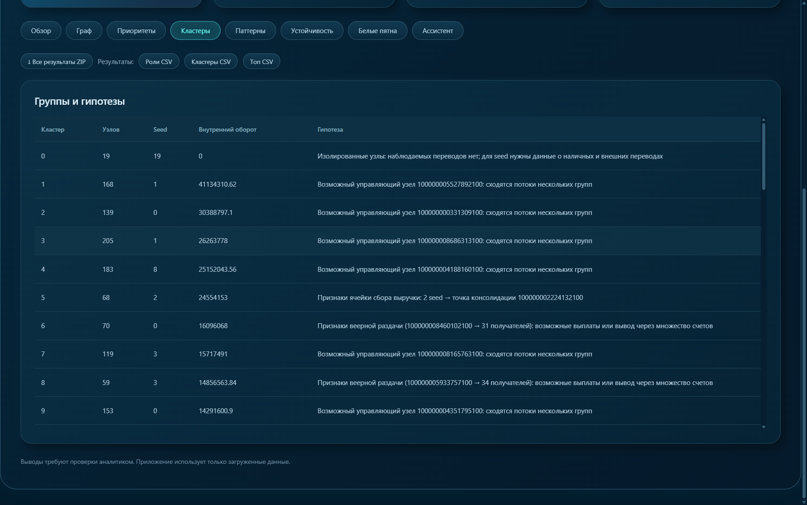
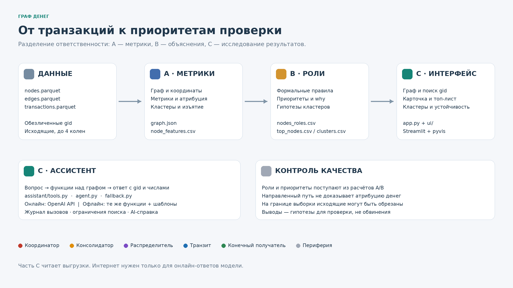
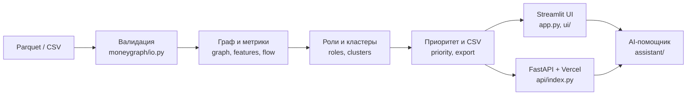

# Граф денег — HackAlem AI

**Трек:** Финансы · **Кейс:** восстановление финансовой структуры организованной группы по транзакционной сети.

> 🌐 **Онлайн-демо:** https://moneygraph-hackalem.vercel.app (без пароля, конкурсный набор уже рассчитан)
> 🎬 **Видео работы:** https://youtu.be/76Vf1yPgT2w



## Какую проблему решаем

У аналитика финмониторинга есть 81 подозрительный клиент (seed) и выгрузка их переводов на 4 колена: **2 248 клиентов, 3 119 связей, 4 840 транзакций**. Вручную понять, кто в этой сети собирает деньги, кто раздаёт, кто транзит, а кто конечный получатель, — это дни работы.

**«Граф денег»** за один запуск (≤ 5 минут, на практике ≈ 2 минуты):

1. **Назначает роль каждому узлу**: `consolidator`, `distributor`, `transit`, `terminal`, `coordinator`, `peripheral`, с баллом 0–1 и текстовым обоснованием.
2. **Находит группы (кластеры)** методом Louvain и формулирует гипотезу о назначении каждой группы.
3. **Ранжирует узлы по приоритету проверки** (топ-50) и объясняет, почему узел в топе.
4. **Показывает интерактивный граф**: поиск по gid, направления переводов, раскраска по ролям и кластерам, карточка узла с потоками и сработавшими правилами.
5. **Отвечает на вопросы** через AI-помощника (OpenAI, вызов инструментов по данным графа). Без ключа помощник работает офлайн по правилам.

Результаты — **гипотезы для проверки аналитиком, а не доказательство вины**. Все правила прозрачны и настраиваются в `config.yaml`.

| Граф и карточка узла | Кластеры и гипотезы |
|---|---|
|  |  |

## Технологии

| Слой | Стек |
|---|---|
| Анализ | Python 3.12, pandas, PyArrow, NumPy, SciPy, NetworkX (PageRank, betweenness, Louvain) |
| Веб-версия | FastAPI + vis-network, деплой на Vercel (`api/index.py`) |
| Локальный интерфейс | Streamlit, pyvis, Altair |
| AI-помощник | OpenAI API (`gpt-4.1-mini`, function calling, JSON Schema), офлайн-фолбэк |
| Качество | pytest: `tests/` (расчёт, API) и `tests_c/` (UI, помощник) |

## Быстрый запуск

### Вариант 1. Открыть онлайн
https://moneygraph-hackalem.vercel.app — ничего устанавливать не нужно.

### Вариант 2. Windows, в один клик
Нужен **Python 3.12**. Положите `nodes.parquet`, `edges.parquet`, `transactions.parquet` в папку `data/` (необязательно: без них откроется форма загрузки).

| Действие | Что произойдёт |
|---|---|
| Двойной клик `START.cmd` | Создаст `.venv`, поставит зависимости, выполнит расчёт по `data/` и откроет Streamlit на http://localhost:8501 |
| Двойной клик `START_WEB.cmd` | Запустит веб-версию (как на Vercel) на http://127.0.0.1:8600 |
| `START.cmd -Check` | Запустит все тесты |
| `START.cmd -Demo` | Демо на вымышленных данных, без расчёта |

### Вариант 3. Вручную (любая ОС)

```bash
python3.12 -m venv .venv
# Windows: .venv\Scripts\activate   |   Linux/macOS: source .venv/bin/activate
pip install -r requirements-lock.txt

# 1) Расчёт: Parquet → CSV (≤ 5 минут)
python -X utf8 run.py --data data --out output/current --config config.yaml

# 2) Интерфейс
streamlit run app.py                                   # локальный UI
python -m uvicorn api.index:app --port 8600            # веб-версия
```

**AI-помощник (необязательно):** скопируйте `.env.example` в `.env` и укажите `OPENAI_API_KEY`. Расчёт ролей, кластеров и приоритетов от ключа **не зависит**. Подробности: [docs/OPENAI_VERCEL.md](docs/OPENAI_VERCEL.md).

## Как проверить решение (для жюри)

1. **Расчёт.** Выполните `run.py` (см. выше) и откройте `output/current/run_report.json`: там должны быть `"status": "ok"` и `elapsed_seconds < 300`.
2. **Обязательные выгрузки** в `output/current/`:
   - `nodes_roles.csv`: `gid, role, role_score, cluster_id, priority_score, evidence`. Все 2 248 узлов с ролью и обоснованием.
   - `clusters.csv`: `cluster_id, n_nodes, n_seed, sum_kzt_internal, top_gids, hypothesis`.
   - `top_nodes.csv`: `rank, gid, role, priority_score, why`. Топ-50.
3. **Интерфейс.** Обзор → Приоритеты → Граф: найдите gid из топа и откройте карточку. В ней роль, балл, сработавшие правила и входящие и исходящие потоки.
4. **Свои данные.** Блок «Загрузить файлы и выполнить анализ» принимает Parquet или CSV по схеме ниже. Некорректные файлы отклоняются с объяснением.
5. **Помощник.** Вкладка чата, например вопрос: «Кто главный консолидатор и откуда к нему идут деньги?»
6. **Тесты.** `python -X utf8 -m pytest -q`.

Подробный сценарий и контрольные узлы: [docs/CHECK_PROJECT.md](docs/CHECK_PROJECT.md).

## Формат входных данных

| Файл | Обязательные колонки |
|---|---|
| `nodes.parquet` / `.csv` | `gid` (int64), `depth` (0 = seed), `is_seed` (bool / 0-1) |
| `edges.parquet` / `.csv` | `src`, `dst`, `sum_kzt`, `n_tx`, `depth` |
| `transactions.parquet` / `.csv` | `src`, `dst`, `date` (ISO), `sum_kzt` |

CSV: UTF-8, разделитель — запятая. Концы рёбер должны быть в nodes, суммы в edges должны сходиться с transactions. Описание конкурсного датасета: [docs/DATASET.md](docs/DATASET.md).

## Как принимаются решения

| Роль | Основное условие |
|---|---|
| consolidator | ≥ 5 плательщиков; балл учитывает число источников и равномерность входов |
| distributor | не граница выборки, ≥ 10 получателей |
| transit | не граница, степени ≤ 3, есть исходящие; для не-seed out/in от 0,8 до 1,2 |
| terminal | не граница, вход ≥ медианы; нет исходящих (или out/in ≤ 0,2 для не-seed) |
| coordinator | не граница; ≥ 2 сигнала: сходимость seed, ролевые соседи, мостовая позиция |
| peripheral | ни одно правило не сработало |

**Приоритет** = 0,35 × перцентиль seed-оборота + 0,20 × перцентиль seed-источников + 0,15 × max(перцентиль PageRank, betweenness) + 0,30 × вес роли × role_score (для самих seed × 0,85). Формулы: [docs/roles.md](docs/roles.md), методы: [docs/METHODS.md](docs/METHODS.md).

**Дополнительные сигналы:** транзит в окне 2 дней, повторяющиеся цепочки A→B→C, дробление платежей (≥ 3 близкие суммы в день), циклы длиной до 5, устойчивость сети при удалении топ-узлов, список следующих запросов данных. На конкурсном наборе найдено 120 повторяющихся цепочек и 7 групп близких платежей.

**Дополнительные выгрузки:** `node_features.csv`, `graph.json`, `data_quality.md`, `next_requests.csv`, `cluster_metrics.csv`, `cycles.csv`, `resilience.csv`, `repeated_routes.csv`, `splitting.csv`.

## Архитектура





```
moneygraph/   расчётный конвейер (граф, метрики, роли, кластеры, приоритет, экспорт)
assistant/    LLM-агент с инструментами по графу + офлайн-фолбэк
api/          FastAPI для веб-версии (Vercel)
ui/, app.py   Streamlit-интерфейс
run.py        CLI: Parquet → CSV
config.yaml   все пороги и веса
tests/, tests_c/  автотесты
docs/         методы, роли, проверка, демо
```

## Ограничения

- Пороги ролей — наши эвристики. Разметки (ground truth) нет, поэтому `role_score` — это не вероятность, а accuracy не измерена.
- Граница выборки (4-е колено) защищена от ложной роли `terminal`: у крайних узлов исходящие просто не выгружены.
- Haircut-атрибуция моделирует пропорциональное смешение денег и не доказывает движение конкретной операции.
- Решение рассчитано на конкурсный объём. Для миллиона узлов понадобятся чтение по частям, CSR/igraph и приближённые центральности; на таком объёме проект не проверялся.
- Данные организаторов обезличены и включены в `showcase/` только для демонстрации; репозиторий приватный. Решение не использует ФИО, ИИН и иные персональные данные. `.env` и окружения в Git не входят.

## Команда

- **Artyom** — граф, метрики, атрибуция потоков
- **Kostya** — роли, скоринг, конвейер
- **Maksim** — интерфейс и AI-помощник
