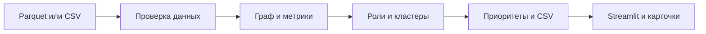

# Граф денег — HackAlem AI

Локальный анализ транзакционной сети: три файла → роли участников, кластеры, приоритеты и интерактивный граф. Результаты — гипотезы для проверки, не доказательства виновности.

## Самый простой запуск на Windows

**Дважды нажмите `START.cmd`.** Нужен установленный Python 3.12.

При первом запуске скрипт создаёт окружение и устанавливает зависимости, если они отсутствуют. При наличии файлов в `data/` автоматически выполняет расчёт, затем открывает Streamlit в браузере. Дождитесь окончания расчёта и оставьте окно запуска открытым. Для остановки нажмите Ctrl+C. Перед повторным запуском остановите старое окно, чтобы освободить порт 8501.

Первичная установка требует интернета или локального кэша пакетов. Последующие расчёты и интерфейс работают локально. Расчёты работают без API-ключа. Чат и AI-справки восстановлены: для OpenAI задайте OPENAI_API_KEY в локальном .env (в веб-версии подключение автоматическое; в Streamlit включите онлайн-режим). Без ключа доступны ответы по правилам. Инструкция: [ключ, безопасный push и Vercel](docs/OPENAI_VERCEL.md).

Если файлов нет, откроется приложение с загрузкой. Можно включить «Демонстрационный пример» — это вымышленные данные, не результат решения конкурсного кейса.

## Веб-версия для Vercel

Двойной щелчок по **START_WEB.cmd** запускает тот же интерфейс, который развёртывается на Vercel. Сервер FastAPI использует существующие расчёты и помощника. При открытии автоматически показан рассчитанный конкурсный набор, пароль не требуется. Можно пересчитать его из Parquet или загрузить свои файлы. GPT-ключ хранится только на сервере. Настройки сервера и ограничения — [инструкция](docs/OPENAI_VERCEL.md).

## Работа со своими файлами

В блоке **«Загрузить файлы и выполнить анализ»** выберите три файла и нажмите **«Загрузить и проанализировать»**. Поддерживаются Parquet и CSV (UTF-8, разделитель — запятая).

| Файл | Обязательные колонки |
|---|---|
| nodes.parquet / nodes.csv | gid, depth, is_seed |
| edges.parquet / edges.csv | src, dst, sum_kzt, n_tx, depth |
| transactions.parquet / transactions.csv | src, dst, date, sum_kzt |

`gid`, `src`, `dst` — целые int64; `depth` — неотрицательное целое колено; `is_seed` — true/false или 0/1. `sum_kzt` — неотрицательная сумма в KZT, `n_tx` — число операций, `date` — дата/время ISO. Концы рёбер должны присутствовать в nodes. Агрегированные суммы и количества edges должны совпадать с transactions. Некорректные файлы отклоняются с объяснением.

**На других данных анализ работает при соблюдении этой схемы и смысла полей.** Количество клиентов, gid и даты не зашиты в правила ролей. Если сеть полная, снимите флажок ограничения глубины; если выгрузка обрывается, укажите последнее колено. Для данных организаторов оставьте 4. Иные валюты и произвольные банковские выписки предварительно приведите к схеме; автоматического понимания любых документов нет.

Новый набор сохраняется отдельно в `output/uploads/`, исходные данные не перезаписываются. При ошибке новый результат не подменяет предыдущий. У загруженных наборов нет проверки на фиксированные 2 248 узлов и июль 2026. Выбранные граница и профиль сохраняются в конфигурации набора.

Результаты видны сразу после анализа. Три обязательных CSV можно скачать отдельно. В веб-версии кнопка **«Все результаты ZIP»** выгружает все аналитические CSV, граф и параметры расчёта.

## Данные организаторов и запуск командой

Положите `nodes.parquet`, `edges.parquet`, `transactions.parquet` в `data/` либо `data/data/`. `START.cmd` сам выполняет этот расчёт и показывает `output/current/`.

Для запуска вручную после установки зависимостей:

```powershell
.\.venv\Scripts\python.exe -X utf8 run.py --data data --out output/current --config config.yaml
```

`run_report.json` должен содержать `status: "ok"`, `elapsed_seconds < 300`. При ошибке не использовать старые CSV как результат нового расчёта.

Ручная установка:

```powershell
py -3.12 -m venv .venv
.\.venv\Scripts\python.exe -m pip install -r requirements-lock.txt
```

Если в уже существующем окружении отсутствует pip: `.\.venv\Scripts\python.exe -m ensurepip --upgrade`. `START.cmd` проверяет и восстанавливает pip автоматически. Проверка всех тестов одной командой: **`START.cmd -Check`**. Демонстрационный режим без расчёта: `START.cmd -Demo`.

## Что реализовано по ТЗ

| Обязательное требование | Реализация |
|---|---|
| Один запуск Parquet → 3 CSV за ≤5 минут | run.py; время и статус в run_report.json |
| Роли и баллы у каждого узла | Шесть ролей, score 0–1, evidence до 200 символов |
| Объяснимые критерии | config.yaml, docs/roles.md, метрики и rule_fired в карточке |
| Кластеризация | Louvain, размер, seed, внутренний оборот, гипотеза назначения |
| Топ ≥20 и экран | Топ-50 на конкурсном наборе; направления переводов, роли/кластеры, поиск gid |

Для набора меньше 50 узлов топ содержит все узлы; для набора меньше 20 условие конкурсного топа ≥20 неприменимо. Данные организаторов содержат 2 248 узлов, 3 119 рёбер, 4 840 транзакций. Выгрузки UTF-8, без индекса:

- `nodes_roles.csv`: gid, role, role_score, cluster_id, priority_score, evidence.
- `clusters.csv`: cluster_id, n_nodes, n_seed, sum_kzt_internal, top_gids, hypothesis.
- `top_nodes.csv`: rank, gid, role, priority_score, why.

Дополнительно: `node_features.csv`, `graph.json`, `data_quality.md`, `run_report.json`, `next_requests.csv`, `cluster_metrics.csv`, `cycles.csv`, `resilience.csv`, `repeated_routes.csv`, `splitting.csv`.

## Правила ролей и приоритета

| Роль | Основное условие кандидата |
|---|---|
| consolidator | ≥5 плательщиков; балл учитывает число источников и равномерность входов |
| distributor | Не граница, ≥10 получателей |
| transit | Не граница, степени ≤3, есть исходящие; для не-seed out/in от 0,8 до 1,2 |
| terminal | Не граница, вход не ниже медианы положительных входов; нет исходящих или для не-seed out/in≤0,2 |
| coordinator | Не граница; ≥2 сигналов: сходимость seed, ролевые соседи, мостовая позиция |
| peripheral | Ни один кандидат не подошёл |

Сначала выбирается лучшая допустимая базовая роль, затем проверяется coordinator. Полные формулы и поправки — [docs/roles.md](docs/roles.md). Пороги — наши эвристики, не предписанные ТЗ ответы.

Приоритет: 0,35 × перцентиль seed-оборота + 0,20 × перцентиль seed-источников + 0,15 × максимум перцентилей PageRank/betweenness + 0,30 × вес роли × role_score; для seed коэффициент 0,85. Веса ролей заданы в config.yaml. В карточке есть причины, баллы, потоки и краткая справка по данным без генеративного ИИ.

## Дополнительная аналитика и ограничения

- Граница выборки защищена от ложного terminal; входящий баланс seed не считается полным.
- Есть транзит в окне 2 дней, всплески и синхронные поступления, робастные аномалии относительно колена.
- Повторяющаяся A→B→C: перевод B→C следует после A→B в окне 2 дней, наблюдается минимум в 2 разных днях поступления. Одна входящая операция не считается несколькими эпизодами. Это временная гипотеза, не доказанная трассировка денег. Поиск ограничен 50 000 парами маршрутов; усечение отмечается в отчёте.
- Возможное дробление: минимум 3 платежа за день от одного отправителя одному получателю, максимальная сумма не более чем на 20% выше минимальной. Это индикатор повторяющихся близких сумм, не утверждение об обходе законодательного порога. Платежи ниже порога исходной выгрузки не видны.
- Циклы до длины 5, сценарии удаления 5/10/20/50 узлов, сравнение с удалением по степени и случайным выбором, следующие запросы данных.
- Haircut моделирует пропорциональное смешение денег без доказательства движения конкретной операции. role_score не является вероятностью, ground truth и измеренной accuracy нет. Пороги для иной предметной области нужно проверять экспертно.
- Устойчивость топа — чувствительность к весам, а не точность. Изъятия пересчитывают подпитку: flow_share может превышать 1. Приоритет проверки не обязан лучше всех разрушать граф.

## Самостоятельная проверка и защита

Порядок действий и контрольные узлы — [docs/CHECK_PROJECT.md](docs/CHECK_PROJECT.md). Актуальное состояние — этот README и указанная инструкция. Предыдущие аудиты и документы A/B/C фиксируют историю разработки; актуальные настройки OpenAI и Vercel описаны в [docs/OPENAI_VERCEL.md](docs/OPENAI_VERCEL.md).

## Архитектура и масштабирование



Python, pandas/PyArrow, NumPy/SciPy, NetworkX, Streamlit, pyvis и Altair. `moneygraph/` — расчёт; `ui/` — просмотр и загрузка; `tests/`, `tests_c/` — проверки. Адаптер будущего помощника остаётся в `assistant/`, но LLM-модуль не импортируется основным приложением.

Для миллиона узлов потребуются чтение/агрегация по частям, CSR/igraph, приближённые центральности, пакетная атрибуция, загрузка выбранного кластера или эго-графа вместо полной визуализации. Текущий вариант рассчитан на конкурсный объём; миллион узлов не проверен.

Исходные данные, выгрузки, окружения и ключи не включены в Git. Для сдачи отдельно приложите три CSV из успешного расчёта, код, README, конфиг, зависимости и диаграмму. Не передавайте `.env` и локальные окружения.

Artyom — граф, метрики и атрибуция; Kostya — роли, скоринг и пайплайн; Maksim — интерфейс.
