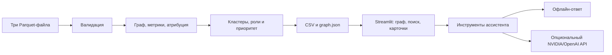

# Граф денег — HackAlem AI

**Кого из 2 248 клиентов проверить первым и почему?** Наш инструмент помогает
AML-аналитику восстановить структуру финансовой сети по обезличенным переводам:
найти точки консолидации, транзитные счета, распределителей и возможных
координаторов, увидеть их связи и получить объяснимый список приоритетов.

Три Parquet-файла → метрики и роли → CSV и интерактивный граф.
Результаты — **гипотезы для проверки, не выводы о виновности**.
Обучение модели, GPU и платный API для основного сценария не нужны.

**Проверено на выданных данных:** 2 248 узлов, 3 119 рёбер, 4 840 транзакций.
В новом Python-окружении **101 тест прошёл**, полный расчёт — **117,49 с**
при лимите ТЗ **300 с**. Это замер на нашей Windows-машине, а не гарантия
одинакового времени на любом оборудовании.

## Что получает аналитик

- Направленный граф с раскраской по ролям/кластерам и поиском по `gid`.
- Топ-50 приоритетных узлов с обоснованиями.
- Карточку клиента: потоки, контрагенты, баллы и сработавшие правила.
- Кластеры с оборотом, числом seed-клиентов и гипотезой назначения.
- Временные паттерны, циклы, сценарии изъятия и следующие запросы данных.
- Офлайн-ассистента для карточек, соседей, путей и других поддерживаемых вопросов.
  Онлайн-LLM через NVIDIA/OpenAI — дополнительный режим.

## Запуск на данных организаторов

Нужны **Python 3.12**, Git и обычный ноутбук. Интернет требуется для установки
зависимостей; расчёт и интерфейс после установки работают локально.
Проверенная конфигурация — Windows / Python 3.12.14.

### 1. Скачать проект и установить зависимости

Windows PowerShell:

```powershell
git clone https://github.com/BAITC-Hacks/hack-db041ec5-team.git
cd hack-db041ec5-team
python -m venv .venv
.venv\Scripts\python.exe -m pip install -r requirements-lock.txt
```

`requirements-lock.txt` фиксирует точные версии всех частей проекта;
`requirements.txt` описывает допустимые диапазоны.

### 2. Добавить исходные данные

Распакуйте выданный архив в папку `data/`:

```text
data/
  nodes.parquet
  edges.parquet
  transactions.parquet
```

Вложенный вариант `data/data/*.parquet` также поддерживается автоматически.
Исходные данные и ключи **не хранятся в Git**: для проверки жюри использует
свой выданный архив. [Описание полей организаторов](README%20%282%29.md).

### 3. Выполнить полный расчёт одной командой

```powershell
.venv\Scripts\python.exe -X utf8 run.py --data data --out output/real --config config.yaml
```

В `output/real/` появятся все обязательные выгрузки и `run_report.json`.
Признак успеха: `status: "ok"`; время — `elapsed_seconds`. При ошибке расчёта
не используйте старые CSV, оставшиеся от предыдущего запуска.

### 4. Открыть интерфейс

```powershell
.venv\Scripts\python.exe -m streamlit run app.py --server.address 127.0.0.1
```

Откройте **[http://127.0.0.1:8501](http://127.0.0.1:8501)**. В «Источники данных»
проверьте `output/real` и `data`; «Демонстрационный пример» должен быть выключен.
По умолчанию UI ищет выгрузки в `output/`, затем в `output/real/`.
Альтернативный запуск на Windows — `./start.ps1`.

На Linux/macOS для создания окружения обычно нужен `python3`; вместо
`.venv\Scripts\python.exe` используйте `.venv/bin/python`. Отдельная проверка
на этих ОС не проводилась.

### Если датасета пока нет

Запустите интерфейс и включите «Демонстрационный пример» либо выполните
`./start.ps1 -Demo` на Windows. Это **вымышленные данные для показа UI**,
они не являются результатом решения кейса.

## Как жюри проверить решение

1. Запустить расчёт; проверить `status: "ok"` и время <300 с в отчёте.
2. Проверить `nodes_roles.csv`: 2 248 уникальных `gid`, заполненные роли и
   объяснения, `role_score` и `priority_score` от 0 до 1.
3. Проверить `clusters.csv` и `top_nodes.csv`: кластеры покрывают все узлы,
   топ содержит 50 строк по убыванию приоритета и обоснование `why`.
4. На вкладке «Граф» найти произвольный `gid` из CSV, показать направление
   переводов, соседей и карточку. Переключить раскраску на кластеры.
5. Проверить `100000000404740100`: четвёртое колено, входящие 25 000 KZT,
   исходящие 0, роль `peripheral`, а не ложный `terminal`.
   Для разбора приоритета — `100000003115284100` из текущего топа.
6. В офлайн-ассистенте задать «Карточка 100000003115284100» и сверить числа
   с CSV и результатом инструмента. API-ключ не нужен.
7. Запустить автоматические проверки:

```powershell
.venv\Scripts\python.exe -X utf8 -m pytest -q --durations=5
```

С данными организаторов выполняются и реальные интеграционные тесты;
без них соответствующие проверки пропускаются. Тесты покрывают формулы,
граничные случаи, отсутствие мутации входов, перестановку `gid`, CSV,
загрузку UI, поиск реального узла и ошибки ассистента.
Последний полный результат — **101 passed, 2 ожидаемых предупреждения**.
NVIDIA-адаптер проверен подставными ответами, не живым API.

Пяти­минутный сценарий защиты: [DELIVERY_CHECK](docs/DELIVERY_CHECK.md).

## Технологии и архитектура

| Компонент | Технологии | Назначение |
|---|---|---|
| Данные | Python, pandas, PyArrow | Parquet, валидация и CSV |
| Расчёты | NumPy, SciPy | Метрики и разреженная атрибуция источников |
| Граф | NetworkX | Направленные связи, центральности, Louvain, циклы |
| Интерфейс | Streamlit, pyvis/vis.js, Altair | Граф, поиск, карточки, диаграммы |
| Ассистент | Локальные инструменты, OpenAI-совместимый SDK | Офлайн и опциональный NVIDIA/OpenAI API |
| Проверки | pytest, Streamlit AppTest, JSON Schema | Модульные и интеграционные тесты |



Подробнее: [ARCHITECTURE](docs/ARCHITECTURE.md).

## Как определяются роли и приоритет

Роли задаются формальными правилами. Размеченных ролей в датасете нет:
`role_score` — эвристический балл, **не измеренная вероятность**.
Все настройки находятся в [config.yaml](config.yaml).

| Роль | Основное условие кандидата |
|---|---|
| `consolidator` | Не менее 5 плательщиков; балл учитывает число источников и равномерность сумм |
| `distributor` | Не frontier, не менее 10 получателей |
| `transit` | Не frontier, степени ≤3, есть исходящие; для не-seed out/in в диапазоне 0,8–1,2 |
| `terminal` | Не frontier, вход ≥медианы положительных входов; нет исходящих или для не-seed out/in≤0,2 |
| `coordinator` | Не frontier, минимум 2 сигнала: сходимость seed, ролевые соседи, мостовая позиция |
| `peripheral` | Ни одно активное правило не выполнено |

Сначала выбирается базовая роль с максимальным допустимым баллом, затем
проверяется coordinator. Для seed и границы выборки действуют поправки.
Точные формулы, пороги и разрешение равенств: [правила ролей](docs/roles.md).
В `node_features.csv` сохранены все баллы и `rule_fired` для любого `gid`.

Приоритет — сумма перцентилей seed-оборота (вес 0,35), количества seed-источников
(0,20), центральности (0,15) и ролевого балла (0,30); для seed коэффициент 0,85.
Устойчивость топа проверяется на 200 вариантах весов; на реальных данных
средний Jaccard топ-20 — 0,9382.

Haircut-атрибуция моделирует пропорциональную смесь источников денег.
Это гипотеза, которая не доказывает движение конкретного перевода.
Louvain применяется к ненаправленной проекции с log1p-весами;
потоки и граф для аналитика сохраняют направление.
Полное описание: [методы и ограничения](docs/METHODS.md).

## Выходные файлы

Обязательные CSV — UTF-8 без BOM, без индекса, с фиксированной схемой:

| Файл | Колонки |
|---|---|
| `nodes_roles.csv` | gid, role, role_score, cluster_id, priority_score, evidence |
| `clusters.csv` | cluster_id, n_nodes, n_seed, sum_kzt_internal, top_gids, hypothesis |
| `top_nodes.csv` | rank, gid, role, priority_score, why |

`evidence` непустой и ≤200 символов; `gid` — int64. В браузерном `graph.json`
ID передаются строками: реальные значения превышают безопасный диапазон
JavaScript Number. Это сохраняет точный поиск клиента.

Дополнительно: `node_features.csv`, `graph.json`, `data_quality.md`,
`run_report.json`, `next_requests.csv`, `cluster_metrics.csv`, `cycles.csv`,
`resilience.csv`. Дополнительные расчёты включаются через `extras` в конфиге.
Выгрузки генерируются локально и не включены в Git.

## Данные и ограничения

Датасет: июль 2026, 81 seed, исходящие внутрибанковские переводы на 4 колена,
порог ≥5 000 KZT. Метрики сопоставлены со starter организаторов.
В результате — 48 кластеров и все шесть ролей; 444 frontier не объявлены
конечными получателями, 19 изолированных seed сохранены.

| Ограничение | Учёт |
|---|---|
| Исходящие 4-го колена не выгружены | Frontier только consolidator/peripheral |
| Входящие seed неполны | out/in для них не используется |
| Переводы ниже порога и внешние каналы отсутствуют | Запросы дополнительных данных |
| Нет разметки ролей | Accuracy не заявляется; нужна экспертная оценка |
| Атрибуция агрегирована за период | Нет гарантии временного порядка переводов |
| Изъятие пересчитывает подпитку | flow_share может превышать 1; это сценарная модель |

**Два предупреждения данных:** узлов с out>in фактически 377 вместо 354
в описании; оборот 365 890 012,01 KZT вместо округлённого 365 890 012.
Мы сохраняем фактические данные и отражаем расхождения в отчёте.
Подробнее: [проверка реальных данных](docs/real_data_review.md).

## Онлайн-ассистент и NVIDIA

Офлайн работает сразу. Онлайн включается явно после настройки локального
`.env`. В API уходят вопрос, короткая история и результаты запрошенных
инструментов; основной расчёт не зависит от LLM.

Подготовлен адаптер NVIDIA API Catalog / NIM с настраиваемым endpoint.
**Код на $50 в Brev не равен готовому API модели:** живое подключение пока
не подтверждено и не требуется для обязательной части ТЗ.
Инструкция: [NVIDIA_SETUP](docs/NVIDIA_SETUP.md).

Ошибки API переводят ответ в офлайн с указанием режима. Текст модели нужно
сверять с фактами: вызов инструмента не гарантирует отсутствия выдумок.
`.env` и ключи не добавляются в репозиторий.

## Масштабирование до миллиона узлов

Потребуются чтение Parquet по частям и агрегация в Polars/DuckDB, компактный
CSR/igraph, приближённая betweenness, Leiden и пакетная атрибуция источников.
В UI следует загружать выбранные кластеры и эго-графы. Полный spring-layout,
точные центральности и поиск всех циклов на таком объёме не подходят;
текущая реализация рассчитана на предоставленный кейс.

## Структура и команда

```text
run.py / config.yaml       общий расчёт и параметры
moneygraph/                граф, метрики, роли, кластеры, выгрузки
app.py / ui/               интерфейс аналитика
assistant/                 инструменты, офлайн и онлайн-ассистент
tests/ / tests_c/           проверки всех компонентов
starter/starter/           исходный каркас организаторов
docs/                      методика, схема, отчёты и сценарий защиты
```

Artyom — граф, метрики и атрибуция; Kostya — роли, скоринг и пайплайн;
Maksim — интерфейс и ассистент. Все три части интегрированы.

[Страница хакатона](https://edu.astanahub.com/hackathons/df4743f5-c492-415c-b45a-1f13adb78e06).
