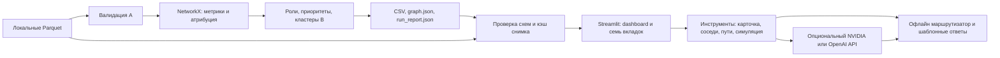

# Архитектура объединённого приложения

- `moneygraph/`, `run.py`: расчёты A/B. UI не меняет рассчитанные роли.
- `ui/data.py`: контракты данных, чтение, проверка, fingerprint снимка.
- `ui/dashboard.py`: показатели, временной фильтр, журнал, экспорт.
- `ui/graph_view.py`, `node_card.py`, `pages.py`: навигация и представление.
- `assistant/tools.py`: разрешённые операции чтения, копия графа для симуляции.
- `assistant/fallback.py`: локальные ответы по поддерживаемым вопросам, без LLM.
- `assistant/agent.py`: опциональный tool calling; переход в офлайн при ошибке.
- `tests/`, `tests_c/`: ядро, интеграция, UI, ассистент.

Офлайн используется по умолчанию. JS графа включён в HTML, внешние CDN не нужны.
Для онлайн передаются вопрос, недавняя история и результаты инструментов.
Инструкции в данных не считаются командами для ассистента.
Онлайн LLM ограничен инструментами и системной инструкцией, но это не формальная
гарантия отсутствия выдумок. Для воспроизводимого ответа используйте офлайн.

Приложение предназначено для локальной работы аналитика. Авторизация нескольких
пользователей, серверное хранилище и журнал действий не реализованы: для публичного
развёртывания это отдельный этап, а текущий сервер слушает только 127.0.0.1.
